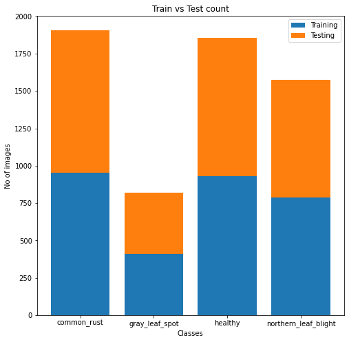

<!-- PROJECT LOGO -->
 

  

<h3 align="center">EARLY PLANT DISEASE DETECTION BY USING TRANSFER LEARNING</h3>

  

    Team : Deep Mind
     
    <a href="https://github.com/github_username/repo_name">Sartaj Bhuvaji</a>
    ·
    <a href="https://github.com/kadamankitaa">Ankita Kadam</a>
    ·
    <a href="https://github.com/Siddheshwari19">Siddheshwari Bankar</a>
  

## Introduction 

The annual worldwide crop loss is estimated to be USD 220 billion due to plant disease. This
results in less food being produced overall and more people suffering from malnutrition.
This problem is critical, especially in developing and underdeveloped countries that do not
have the resources to save crops from the fast spread of disease. Hence, we propose a
system that would be able to identify if the plant leaf is healthy or not. Further, the system
would classify the unhealthy leaves into one of three disease classes. This detection would
help farmers quickly identify the disease that the crop is affected by and take all necessary
actions.

<i>“Detecting and classifying corn (maize) leaves into one of four categories: healthy, northern
leaf blight, common rust, and cercospora spot on gray leaf, using Convolution Neural
Networks and Transfer Learning."</i>

For the project, we would focus on the ‘Corn’ data set and balancing the data set, model
building, and fine-tuning. We plan to try and create our model and train it over the data.
Furthermore, we would also train the models of existing convolutional neural networks like
VGG16, Google Net, Mobile Net, etc. We would also like to try different learning parameters
and see how they affect accuracy over the board. This would help us fine-tune the model
and overall achieve better accuracy.

## DataSet

Dataset: https://www.kaggle.com/datasets/abdallahalidev/plantvillage-dataset

  
  

  
  
  
## Methodology

<b>1. Image processing using CNN:</b>
Convolutional neural networks (CNN)-based image processing will be utilized
to detect plant diseases. This methodology takes images of the leaves and
contrasts them with a dataset that includes healthy, northern leaf blight,
common rust and cercospora leaf spot images of leaves. A deep learning
algorithm, CNN will be used to train the classification model and determine
the leaf in one of the four classes.

<b>2. Transfer learning:</b>
It is a machine learning technique that creates a new model using a
pre-trained data model. As a result, we will use a few leaf images to train a
model, which we will then apply to fresh leaf images in an effort to learn new
things.

## Algorithms

<b>1. Transfer Learning Algorithms</b>

Transfer learning is a machine learning technique where we use a pre-defined and
pre-trained neural network and train it again on the current data set. For this project,
we plan to use the below models for transfer learning.
 

<b>2. Mobile Net</b>

* We have built multiple MobileNet Transfer Learning models with
different freeze layers: 0, 25, 50, 75, 100
* We have built multiple MobileNet Transfer Learning models with
different unfrozen ratios : 0, 0.25, 0.50, 0.75, 1
* We have also trained MobileNet models up till the threshold:
  ● Validation accuracy > 0.90
  ● Validation Loss < 1.00
 

<b>3. Under Sampling </b>

Undersampling is the method to remove the datapoints from majority classes
to create a more balanced class distribution.
For the Corn dataset, we have undersampled the training data for classes:
Common rust, Northern Leaf Blight, and healthy to 410 images to class - gray
leaf spot

## Results:
<b>Best frozen layer output ( FL0 ):</b>

Loss: 0.01376260261 
Accuracy: 0.996017313 
Validation Loss:1.232747465 
Validation Accuracy: 0.8706493735 

<b>Best unfrozen ration output (0.5):</b>

Loss: 0.0069346 
Accuracy: 0.998355 
Validation Loss: 2.1671276 
Validation Accuracy: 0.829091 

<b>Best Unfrozen ratio output with threshold (0.75):</b>

Loss: 0.01491718059 
Accuracy: 0.9959307313 
Validation Loss: 0.5534560919 
Validation Accuracy: 0.9212987065 
Epochs: 56.4 

<b>Undersampling best model Unfrozen ration 0.75:</b>

Loss: 0.00861961707 
Accuracy: 0.9969105721 
Validation Loss:0.7328595161 
Validation Accuracy: 0.908292675 

Report : https://github.com/SartajBhuvaji/Data-Science-Project/blob/main/Report_Deep%20Mind_Early%20plant%20disease%20detection%20by%20using%20transfer%20learning.pdf

